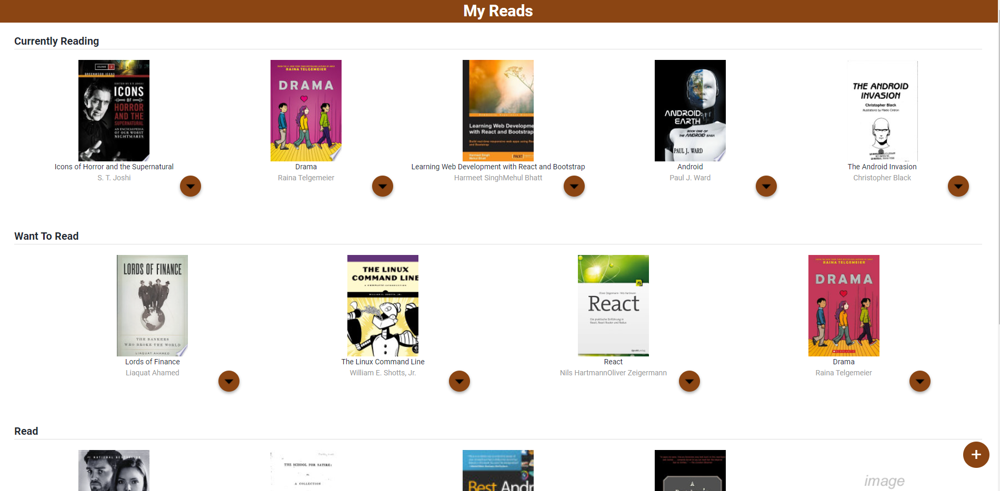

# MyReads Project

You can build your book shelf by using Book API.



## React

Based on React fundamentals, I focused on setting states using React Hooks and displaying them in an efficient way.

## Installation

1. Clone the repository
2. `npm install`
3. `npm start`

## Backend Server

To simplify your development process, we've provided a backend server for you to develop against. The provided file [`BooksAPI.js`](src/BooksAPI.js) contains the methods you will need to perform necessary operations on the backend:

- [`getAll`](#getall)
- [`update`](#update)
- [`search`](#search)

### `getAll`

Method Signature:

```js
getAll();
```

- Returns a Promise which resolves to a JSON object containing a collection of book objects.
- This collection represents the books currently in the bookshelves in your app.

### `update`

Method Signature:

```js
update(book, shelf);
```

- book: `<Object>` containing at minimum an `id` attribute
- shelf: `<String>` contains one of ["wantToRead", "currentlyReading", "read"]
- Returns a Promise which resolves to a JSON object containing the response data of the POST request

### `search`

Method Signature:

```js
search(query);
```

- query: `<String>`
- Returns a Promise which resolves to a JSON object containing a collection of a maximum of 20 book objects.
- These books do not know which shelf they are on. They are raw results only. You'll need to make sure that books have the correct state while on the search page.

## Developer

I am Jiwon who loves React development! Any feedback is appreciated.
